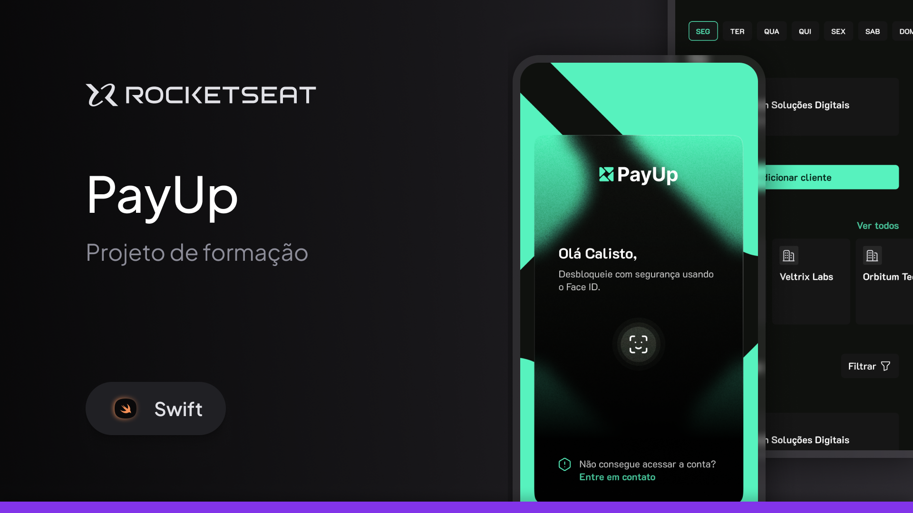
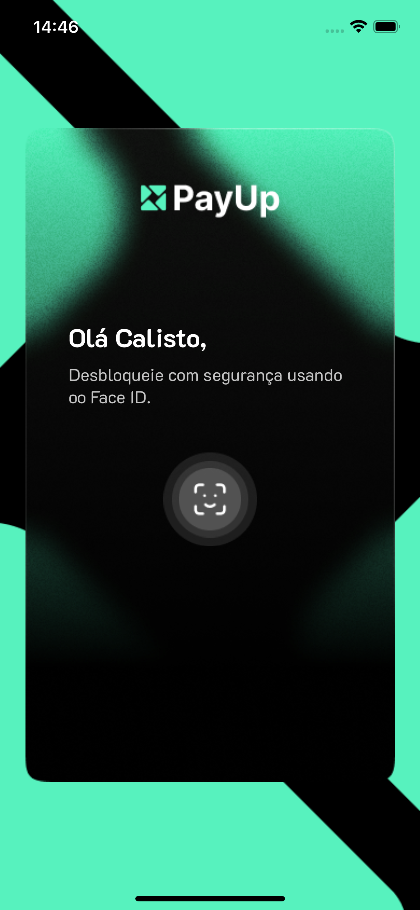
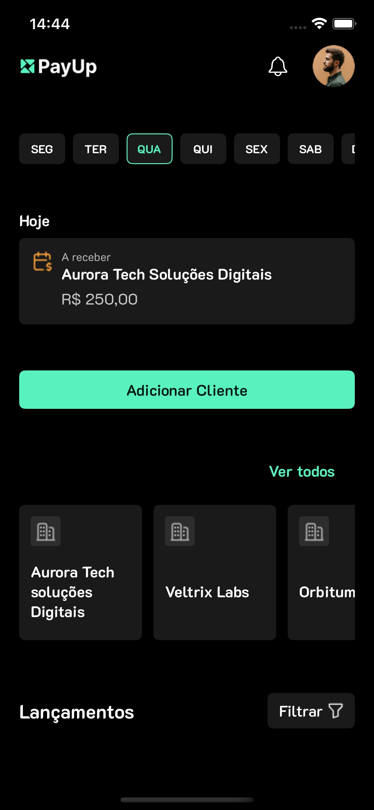
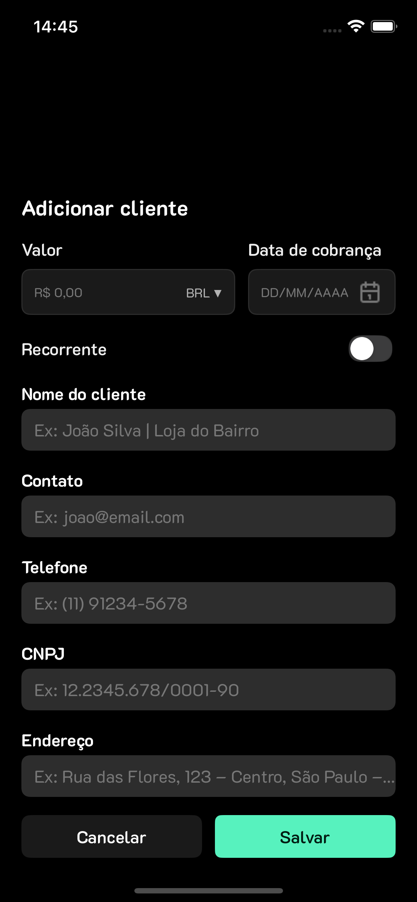

# PayUp

<p align="center">
  
</p>

PayUp é um aplicativo iOS para gerenciamento de pagamentos, desenvolvido como parte da trilha de Swift da **[Rocketseat](https://www.rocketseat.com.br/)**.

## 🎨 Design

O design da interface do usuário para este projeto foi criado pela **[Rocketseat](https://www.rocketseat.com.br/)** e disponibilizado através da trilha de Swift.

## ✨ Funcionalidades

O aplicativo PayUp visa fornecer uma experiência de usuário limpa e intuitiva para o gerenciamento de finanças pessoais. As funcionalidades planejadas incluem:

*   **Autenticação Biométrica:** Acesso seguro usando Face ID.
*   **Tela Inicial (Dashboard):** Visualização rápida do saldo, transações recentes e atalhos.
*   **Formulário de Cliente:** Cadastro e gerenciamento de informações de clientes.
*   **Visualização de Cartões:** Gerenciamento de cartões de pagamento.
*   **Listagem de Empresas:** Visualização de empresas associadas.

## 📱 Telas

Abaixo estão algumas telas do aplicativo. (Substitua os placeholders pelas suas imagens)

| Splash | Home | Client Form |
| --- | --- | --- |
|  |  |  |

## 🛠️ Tecnologias e Arquitetura

Este projeto é construído utilizando as seguintes tecnologias e padrões:

*   **Linguagem:** Swift
*   **Interface:** UIKit
*   **Arquitetura:** Model-View-ViewModel (MVVM)
*   **Layout:** ViewCode (construção de UI programaticamente, sem Storyboards)
*   **Persistência de Dados:** SQLite para armazenamento local.
*   **Fonte Customizada:** K2D (Regular, SemiBold, Bold)

A estrutura do projeto segue uma abordagem componentizada, separando a lógica em `Core` (componentes reutilizáveis, extensões) e `Features` (módulos de funcionalidades específicas como Home, Formulário, etc.).

## 📂 Estrutura de Arquivos

A estrutura principal do código-fonte está localizada em `PayUp/Sources/`:

```
/PayUp/Sources/
├───Core/
│   ├───Colors/         # Cores customizadas
│   ├───Components/     # Componentes de UI reutilizáveis
│   ├───Extensions/     # Extensões para classes do UIKit
│   ├───Models/         # Modelos de dados globais
│   ├───Protocols/      # Protocolos (ex: ViewCodeProtocol)
│   └───Typography/     # Configurações de fontes
└───Features/
    ├───Form/           # Funcionalidade de formulário de cliente
    ├───Home/           # Tela principal do app
    └───Splash/         # Tela de abertura
```

## 🚀 Como Executar

1.  **Clone o repositório:**
    ```bash
    git clone https://github.com/Santosfael/payup
    ```
2.  **Abra o projeto no Xcode:**
    Navegue até a pasta do projeto e abra o arquivo `PayUp.xcodeproj`.
    ```bash
    open PayUp.xcodeproj
    ```
3.  **Compile e Execute:**
    Selecione um simulador de iPhone de sua preferência e clique no botão "Run" (▶).
